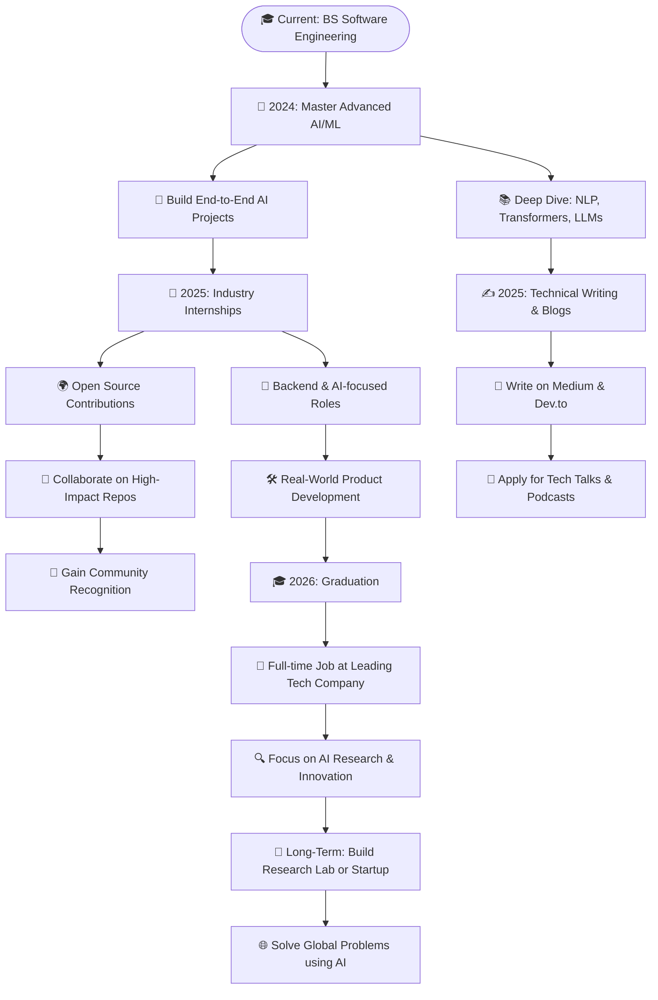

<div align="center">

# 👋 Welcome to Muhammad Sarim's Digital Universe!


</div>

<div align="center">

[](https://git.io/typing-svg)

</div>

<div align="center">

[](https://github.com/M-Sarim)
[](https://github.com/M-Sarim?tab=followers)
[](https://github.com/M-Sarim)

</div>


## 🚀 About Me


I'm a **passionate Software Engineering student** at [**FAST NUCES**](https://www.nu.edu.pk/) with a deep fascination for creating intelligent solutions that make a real-world impact. My journey spans across **Artificial Intelligence**, **Machine Learning**, **Full-Stack Development**, **Computer Vision**, and **Data Science**.

### 🎯 Current Focus
- 🔭 **Working on:** Advanced AI/ML projects and scalable full-stack applications
- 🌱 **Learning:** MLOps, Cloud Architecture, Advanced Deep Learning, and Distributed Systems
- 👯 **Collaborating on:** Open source AI/ML projects and innovative tech solutions
- 🤔 **Exploring:** Quantum Computing, Edge AI, and Blockchain technologies
- 💬 **Ask me about:** Python, JavaScript, AI/ML, Computer Vision, Data Science, or Tech Career Advice
- 📫 **Reach me:** muhammad2004sarim@gmail.com
- ⚡ **Fun fact:** I can debug code faster than I can solve a Rubik's cube! 🧩

### 💭 Daily Inspiration
<div align="center">

[](https://github.com/piyushsuthar/github-readme-quotes)

</div>


## 🛠️ Tech Arsenal & Expertise

<div align="center">

### 💻 Programming Languages


### 🎨 Frontend Development


### ⚙️ Backend Development


### 🤖 AI/ML & Data Science


### 🗄️ Databases & Cloud


### 🛠️ Tools & DevOps


### 🎯 Design & Productivity


</div>

## 🌟 Featured Projects

### 🤖 AI/ML Projects
- **[TensorFlow Deep Learning](https://github.com/M-Sarim/tensorflow-deep-learning)** - Neural network implementations and AI solutions
- **[Computer Vision Projects](https://github.com/M-Sarim/computer-vision-projects)** - Image processing and object detection using OpenCV
- **[Sales Data Analysis](https://github.com/M-Sarim/sales-data-analysis)** - Comprehensive EDA with statistical insights and visualizations

### 💻 Full-Stack Applications
- **[E-commerce Store](https://github.com/M-Sarim/E-commerce-Store)** - Complete e-commerce solution with C# and Oracle Database
- **[Multilingual Dictionary](https://github.com/M-Sarim/multilingual-dictionary)** - Java Swing application with MySQL backend
- **[IHS Clothing Website](https://github.com/M-Sarim/IHS-Clothing-Website)** - Responsive website with modern UI/UX design

### 🔧 Specialized Tools
- **[Research Papers Web Scraper](https://github.com/M-Sarim/research-papers-scraper)** - Automated data collection tool using BeautifulSoup and Selenium
- **[Haskell Functional Programming](https://github.com/M-Sarim/haskell-functional-programming)** - Exploration of functional programming concepts

## 📊 GitHub Analytics & Performance

<div align="center">
  
  
</div>

<div align="center">
  
  
</div>

<div align="center">
  
</div>

<div align="center">
  
</div>

### 🏆 GitHub Achievements & Trophies
<div align="center">
  
</div>

### 📈 Contribution Metrics
<div align="center">  </div>

### ⚡ Real-time Coding Activity
<div align="center">

[](https://wakatime.com/@MSarim)

</div>

<div align="center"> <a href="https://open.spotify.com/user/msarim">  </a> </div>

## 📝 Latest Blog Posts & Technical Writing

<div align="center">

[](https://medium.com/@Muhammad.Sarim)

</div>

I regularly write technical articles on [Medium](https://medium.com/@Muhammad.Sarim) covering:
- 🤖 **AI/ML Algorithms & Implementations** - Deep dives into neural networks and machine learning
- 🔍 **Deepfake Detection Techniques** - Advanced computer vision and AI security
- 🏥 **Disease Prediction Models** - Healthcare AI and predictive analytics
- 📊 **Comparative Analysis of ML Frameworks** - TensorFlow vs PyTorch performance studies
- 💡 **Practical AI Applications** - Real-world implementation guides
- 🚀 **Software Engineering Best Practices** - Clean code and architecture patterns
- 🌐 **Full-Stack Development Tutorials** - Modern web development techniques

## 🤝 Connect with Me

<div align="center">
  
[](https://www.linkedin.com/in/imuhammadsarim/)
[](https://medium.com/@Muhammad.Sarim)
[](mailto:muhammad2004sarim@gmail.com)

</div>

## 🎯 Current Goals & Vision

- 🚀 **Open Source Contribution:** Contributing to major AI/ML open-source projects
- 📚 **Continuous Learning:** Mastering cloud technologies, MLOps, and distributed systems
- 🌟 **Innovation Focus:** Building intelligent solutions that solve real-world problems
- ✍️ **Knowledge Sharing:** Mentoring junior developers and expanding technical writing
- 🤝 **Community Building:** Growing tech communities and fostering collaboration
- 🎓 **Academic Excellence:** Maintaining high GPA while pursuing advanced research

## 🔮 Future Roadmap



## 💡 Fun Facts & Interests

- 🧩 **Problem Solver:** Can debug code faster than solving a Rubik's cube
- 🎮 **Gaming Enthusiast:** Strategy games help improve algorithmic thinking
- 📚 **Continuous Learner:** Always exploring new technologies and frameworks
- 🌍 **Global Perspective:** Interested in how technology impacts different cultures
- 🎨 **Creative Side:** Enjoy UI/UX design and creating visually appealing interfaces
- ☕ **Coffee Lover:** Best code is written with a perfect cup of coffee
- 🏃‍♂️ **Fitness Enthusiast:** Believe in maintaining work-life balance

## 📊 Weekly Development Breakdown

```text
Python       ████████████████████████▓░░░░  85%
JavaScript   ████████████████████▓░░░░░░░░  70%
AI/ML        ███████████████████▓░░░░░░░░░  65%
Web Dev      ██████████████████▓░░░░░░░░░░  60%
Data Science █████████████████▓░░░░░░░░░░░  55%
DevOps       ████████████▓░░░░░░░░░░░░░░░░  40%
```

## 🤝 Open Source Contributions

<div align="center">

[](https://github.com/M-Sarim)
[](https://github.com/M-Sarim)
[](https://github.com/M-Sarim?tab=repositories)

</div>

### 🌍 Contributing to the Community
- **Open Source Projects:** Regular contributor to AI/ML and web development projects
- **Code Reviews:** Helping fellow developers improve their code quality
- **Documentation:** Writing comprehensive documentation for complex projects
- **Mentoring:** Guiding junior developers and students in their coding journey

### 💼 Professional Opportunities
I'm always open to discussing:
- 🚀 **Internship Opportunities** in AI/ML or Full-Stack Development
- 🤝 **Collaboration Projects** on innovative tech solutions
- 📝 **Technical Writing** partnerships and guest posts
- 🎤 **Speaking Engagements** at tech events and conferences
- 👥 **Mentoring Programs** for aspiring developers

---

### 🎉 Thank You for Visiting!

### 💫 "Engineering intelligent solutions for a smarter digital future"

*Ready to build something amazing together? Let's connect and make it happen!* 🚀

**Muhammad Sarim** | Software Engineering Student | AI/ML Enthusiast | Full-Stack Developer

</div>


